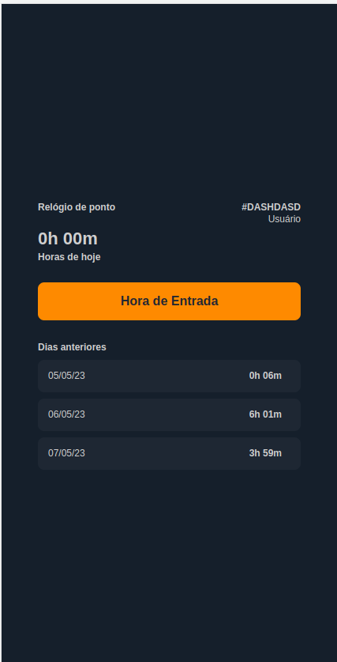

# Ilumeo code Challenge



#### Challenge description
- The details of the challenge can be found in the  [Challenge](challenge.md)


#### Deployed link
- A demo of the application can be accessed <a href="https://ilumeo-challenge-git-feature-auth-felipeschiavini.vercel.app/" target="_blank"> here </a>
- A user with the username `ABCDEF` has already been created.


## Run it on develop environment

I used Node.js version 16.8.1 to develop this application. If you encounter any issues, please try installing the same version of Node.js

### Database

1. copy the "sample.env" and change it's name to .env
2. run `docker compose up` to start the hasura and postgres database.
3. access the database at `http://localhost:8080/console/.`
4. insert same `HASURA_GRAPHQL_ADMIN_SECRET` to acess hasura database.

#### update migrations (only if you want to update database metadata)

1. go to folder hasura "cd hasura"
2. copy the "sample.env" and change it's name to .env

### REACT APPLICATION

1. go to folder `cd web`
2. copy the "sample.env" and change it's name to .env
3. run `npm install`
4. run `npm run dev`

### API

1. go to folder `cd server`
2. copy the "sample.env" and change it's name to .env
3. run `npm install`
4. run `npm run start:dev`
5. go to browser on url `http://localhost:5173/`

#### RUN AUTOMATED TESTS ON API
1. go to folder server `cd server`
2. copy the "sample.env" and change it's name to .env
3. run `npm run test`

#### CREATE USER FOR TEST

- Here are three ways to create a user to use in development mode:

1. You can run `npm run seed` it will create some use on database and return random id. Use it to login

2. You can create a new user running this command on terminal it will return id to login (change <USER_NAME> for your name);

```
  curl --location 'http://localhost:3000/user/create' \
  --header 'Content-Type: application/json' \
  --data '{
      "name": <USER_NAME>
  }'
```

3. you can create manually by hasura at `http://localhost:8080/console/.`
